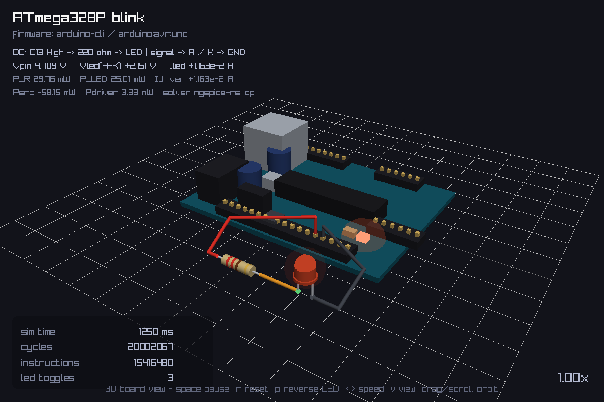
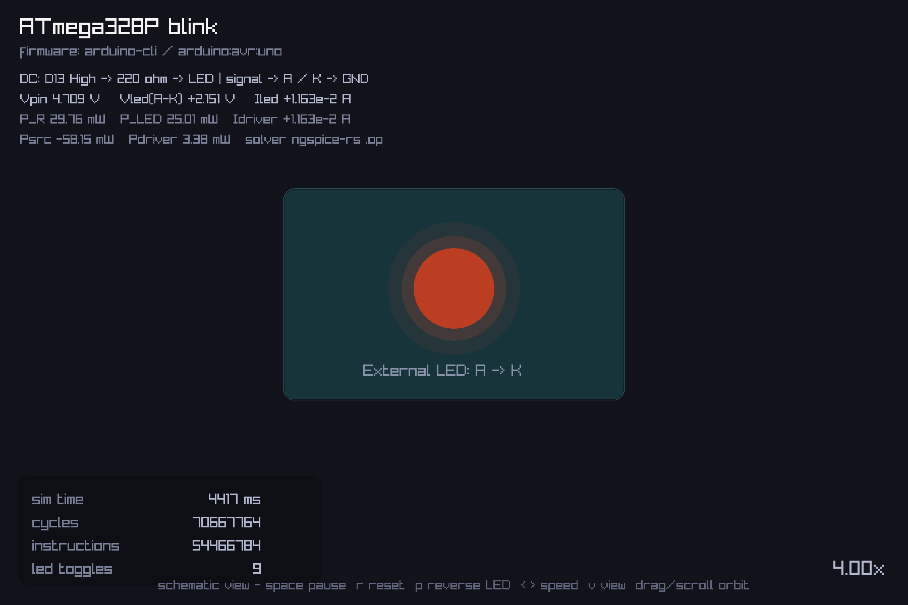
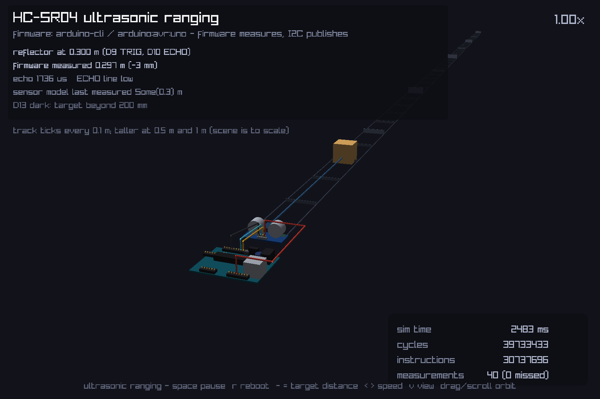
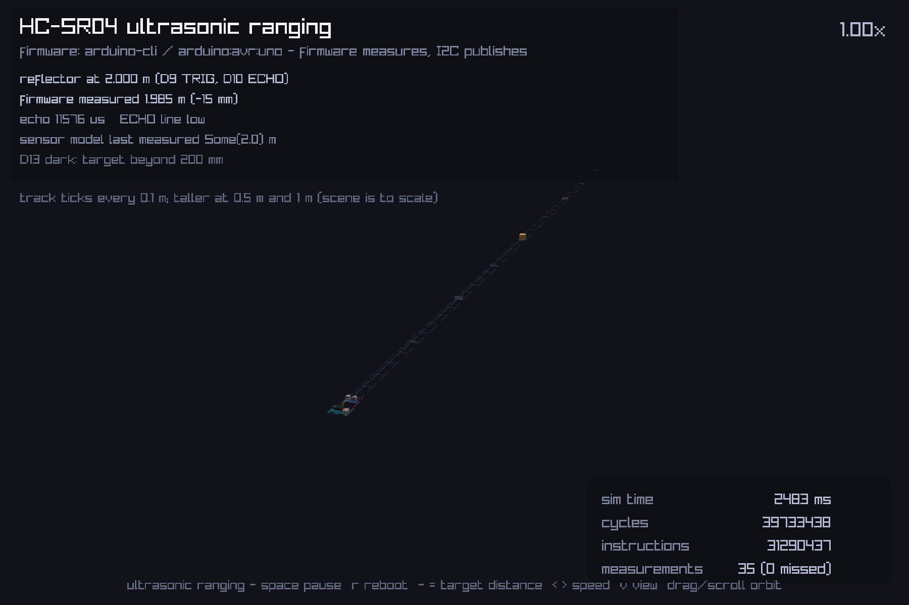
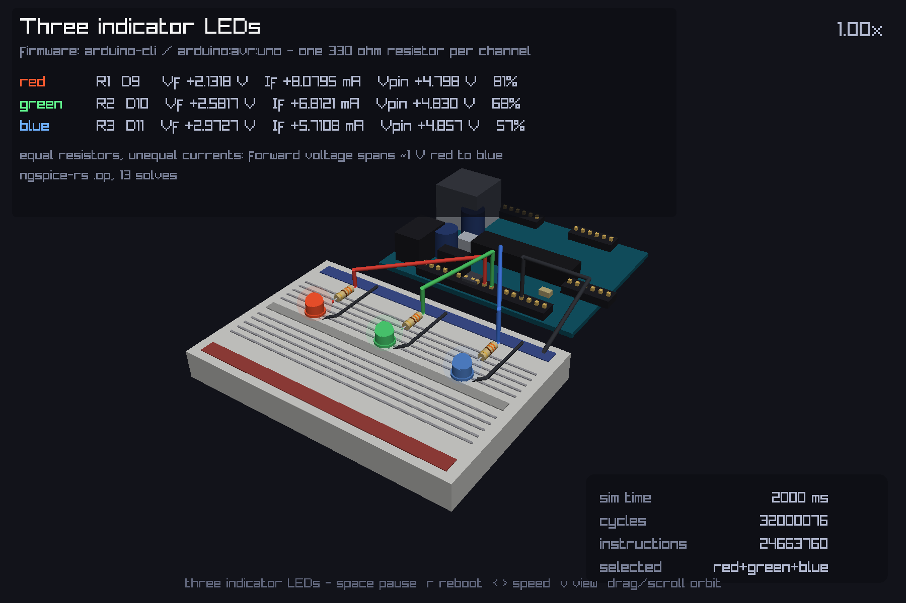
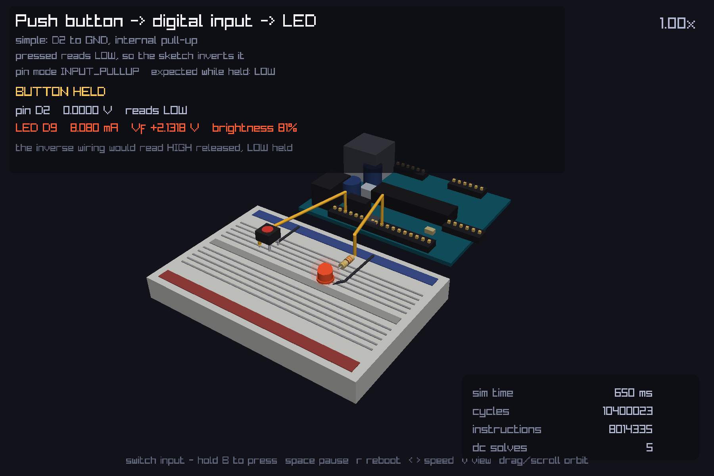
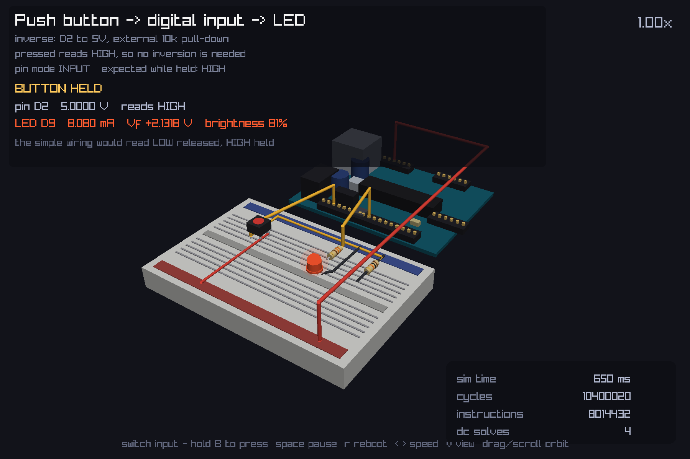

# blink-gui

A raylib front-end for the native AVR simulator in `../rust_port`. Six views
share one window: the simulator runs a **real Arduino sketch** built by
`arduino-cli` for an ATmega328P, and raylib only observes it.

* **Blink** — a `.op` solve by ngspice-rs computes the external circuit's
  voltages and currents, and the external LED is lit by *solved* forward current.
* **Ultrasonic ranging** — a real HC-SR04 sketch pulses TRIG, times ECHO and
  reports its measurement over I2C. The 3D view is **to scale** (1 unit = 10 mm)
  and shows the Uno, the jumpers and the module, with a target cube at the
  distance the **firmware measured**.
* **Three indicator LEDs** — red, green and blue, one 330 Ω resistor each, on a
  breadboard. Equal resistors turn out to be a *different* operating point on
  each colour, because the forward voltages differ by about a volt.
* **Switch inputs** — the same push button wired two ways, reading **opposite
  levels**, each mirroring to an LED.

| View | What it shows | Key |
| --- | --- | --- |
| **Schematic** | Flat external LED, lit by solved forward current | `v` / `tab` |
| **3D board** | Uno plus wired 220 Ω resistor and directional external LED | `v` / `tab` |
| **Ultrasonic ranging** | To-scale Uno wired to an HC-SR04, a 100 mm ruler track and a target cube at the measured distance | `v` / `tab` |
| **Three indicator LEDs** | To-scale breadboard with three 330 Ω resistor/LED columns wired to `D9`, `D10` and `D11` | `v` / `tab` |
| **Switch: simple** | `D2` to GND with the AVR's internal pull-up; pressed reads LOW | `v` / `tab` |
| **Switch: inverse** | `D2` to 5 V with an external 10 kΩ pull-down; pressed reads HIGH | `v` / `tab` |

Both external-LED views use `Sim::analog.brightness()`. The onboard LED remains
an independent digital GPIO indicator; reversing the external LED makes it dark
without changing firmware or the onboard indicator.

## Screenshots

All three views at 1.00x. Every number in these panels is produced by the
simulation: the blink readout is a solved nonlinear DC operating point, and the
ranging readout is the value the firmware measured and published over I2C.

### 3D board view



The onboard LED follows GPIO, while the external LED is lit by the *solved*
forward current through the 220 Ω resistor and the directional Shockley LED
model — `Vpin 4.709 V`, `Iled 11.63 mA`. The banded resistor, the jumpers and
all board geometry are procedural; there is no model asset.

### Schematic view



The same operating point, presented flat. The overlay carries signed voltage and
current, absorbed and supplied power, and the KCL residual (`3.2e-14 A`).

### Ultrasonic ranging, to scale



One unit is 10 mm, so the 68.6 mm Uno, the 45 mm module with its 2.54 mm header
pitch, the 1.5 mm jumpers and the 100 mm ruler ticks are all at real size. The
panel reads `firmware measured 0.297 m` against a true `0.300 m`.

The same scene with the target at 2 m shows why the scale is worth keeping:



The whole rig is a few pixels across, because 2 m really is 200 times the
module's 10 mm features. That is the honest picture, not a framing bug — see
[the model limits](#model-limits).

### Three indicator LEDs



Red, green and blue, one 330 Ω resistor each, on a half-size breadboard wired to
`D9`, `D10` and `D11`. The overlay compares the three operating points side by
side, and the finding is that **equal resistors are not equal currents**:

| Colour | Forward voltage | Forward current | Brightness |
| --- | --- | --- | --- |
| red | 2.1318 V | 8.0795 mA | 81% |
| green | 2.5817 V | 6.8121 mA | 68% |
| blue | 2.9727 V | 5.7108 mA | 57% |

Those are solved quantities, not nominal ones. The 330 Ω part is the same in all
three columns; what differs is the LED, whose forward voltage spans about a volt
across the colours. That is why real designs often pick a different resistor per
colour instead of reusing one value.

The driver's own output resistance shows up too: `Vpin` climbs from 4.798 V on
red to 4.857 V on blue, because the 25 Ω pad droops further under the larger red
current.

### Switch inputs





The **same button, the same firmware behaviour, opposite levels**. Both are shown
with the button held:

| Wiring | Button | Pin mode | Released | Held |
| --- | --- | --- | --- | --- |
| simple | `D2` to GND | `INPUT_PULLUP` | 4.9985 V, HIGH | 0.0000 V, LOW |
| inverse | `D2` to 5 V, 10 kΩ to GND | `INPUT` | 0.0005 V, LOW | 5.0000 V, HIGH |

So the simple wiring needs the sketch to invert the reading and the inverse one
does not, which is the whole reason both are worth showing side by side. The cost
of the inverse wiring is an extra resistor, and 500 µA drawn while held instead
of 167 µA.

Those released voltages are not 5.000 V and 0.000 V, and that is deliberate: an
open contact is 100 MΩ of insulation rather than a perfect break, so it loads the
pull-up slightly. The tests assert the divider prediction rather than the ideal
value.

```
  3D board view                                     Schematic view
 ┌────────────────────────────────────┐      ┌──────────────────────────────┐
 │ ATmega328P blink                   │      │ ATmega328P blink             │
 │ firmware: arduino-cli / avr:uno    │      │   ┌──────────────────────┐   │
 │        ╔═══╗  ▄▄▄▄  ██████         │      │   │        ( ● )         │   │
 │   ▮▮▮  ║USB║  ▓▓   ██████   ▮▮▮▮   │      │   │ External LED: A -> K │   │
 │        ╚═══╝  ▓▓   ██████   ▮▮▮▮   │      │   └──────────────────────┘   │
 │   ══════════════════════════════   │      │                              │
 │ sim time        4817 ms            │      │ sim time        4817 ms      │
 │ cycles         77074368       1.00x│      │ cycles         77074368 1.00x│
 │ 3D board view - space pause ...    │      │ schematic - space pause ...  │
 └────────────────────────────────────┘      └──────────────────────────────┘
```

## Why it lives here, not in `rust_port`

This crate is deliberately **outside** the `rust_port` package:

- `rust_port` stays dependency-free, so its `--locked --offline` CI gate
  (`tools/verify-native.sh`, `native-parity.yml`, `arduino-cli.yml`) keeps
  passing unchanged. Adding raylib there would pull roughly 40 crates into that
  lockfile and require vendoring for the offline jobs.
- The raylib dependency is confined to a demo, not the parity contract.
- Nothing here is part of the AVR8js compatibility surface. All simulator access
  goes through `avr_port_tests::board`.

For the same reason this crate is not wired into CI: the parity runners are
headless Ubuntu images, and raylib needs a GPU/display context.

## Requirements

A **system** raylib 5.5 or newer. The dependency is declared as
`default-features = false, features = ["nobuild"]`, which links the library
already on the machine instead of compiling the vendored copy with cmake — so
`cmake` is *not* needed.

```sh
brew install raylib              # macOS
sudo apt install libraylib-dev   # Debian/Ubuntu
```

If your raylib lives somewhere unusual, extend the linker search path in
[`.cargo/config.toml`](.cargo/config.toml), which already covers the Homebrew
prefixes for both macOS architectures.

> **Version note.** `raylib-rs` 6.0 generates its bindings from raylib 6.0
> headers, while Homebrew currently ships the 5.5 dylib. That combination works
> for every call this demo makes, but for an exact match either
> `brew install cmake` and drop `nobuild`, or pin the crate to the `5.5` line.

## Run

```sh
cd blink-gui
cargo run --release
```

Use `--release`. The simulator is roughly 10x slower in a debug build and the
blink will visibly lag.

| Input | Action |
| --- | --- |
| `space` | pause / resume |
| `r` | reset the active demo: reboot the blink sketch, keep the reflector, restart the LED sequence, or reboot the switch sketch |
| `p` | reverse the external LED's anode/cathode connections (blink views only) |
| `←` / `→` (or `↑` / `↓`) | simulated clock rate, 0.25x to 8x |
| `v` or `tab` | cycle through all six views |
| `b` | hold to press the button (switch views only) |
| `-` / `=` (or `[` / `]`) | move the ultrasonic target nearer / further (ranging view only) |
| left-drag | orbit the 3D camera |
| wheel | zoom the 3D camera |

At **1.00x** the firmware runs in real time. Budgeting is done in simulated
*cycles*, not instructions: this firmware retires about 0.77 instructions per
cycle, so stepping a fixed instruction count would run ~1.3x fast.

### Smoke test without watching the window

`BLINK_FRAMES=N` exits after `N` rendered frames and prints a summary;
`BLINK_VIEW=3d` or `=sensor` selects the starting presentation.
`BLINK_REVERSED=1` starts with the LED reversed and `SENSOR_DISTANCE_M=1.2` sets
the reflector's starting position.

`BLINK_SCREENSHOT=shot.png` captures a rendered frame, which is how the images
above are produced. Two raylib behaviours make the hook slightly surprising, so
they are worth knowing before regenerating anything:

* raylib batches 2D draws and only flushes them in `EndDrawing`, so the capture
  has to happen **outside** the draw handle or the entire overlay is missing.
* the capture reflects the frame presented **immediately before** the current
  one, because the read happens across a buffer swap. A blinking subject can
  therefore land in either phase, and the frame count has to be chosen with that
  in mind.
* the value is a *base name* in the working directory: raylib drops any
  directory part, so `docs/shot.png` writes `./shot.png`.

The blink summary includes signed LED voltage/current and DC solves; the ranging
summary includes the reflector's true distance, the firmware's measurement, the
echo width and the sequence count.

The committed images were regenerated from a release build with:

```sh
cd blink-gui
BLINK_VIEW=3d        BLINK_FRAMES=76  BLINK_SCREENSHOT=board3d.png  cargo run --release
BLINK_VIEW=schematic BLINK_FRAMES=76  BLINK_SCREENSHOT=schematic.png cargo run --release
BLINK_VIEW=sensor BLINK_FRAMES=150 SENSOR_DISTANCE_M=0.30 BLINK_SCREENSHOT=ranging.png cargo run --release
BLINK_VIEW=sensor BLINK_FRAMES=150 SENSOR_DISTANCE_M=2.00 BLINK_SCREENSHOT=ranging-2m.png cargo run --release
BLINK_VIEW=leds      BLINK_FRAMES=121 BLINK_SCREENSHOT=leds.png      cargo run --release
BLINK_VIEW=switch    BLINK_FRAMES=40  SWITCH_PRESSED=1 BLINK_SCREENSHOT=switch-pullup.png   cargo run --release
BLINK_VIEW=pulldown  BLINK_FRAMES=40  SWITCH_PRESSED=1 BLINK_SCREENSHOT=switch-pulldown.png cargo run --release
mv board3d.png schematic.png ranging.png ranging-2m.png leds.png switch-pullup.png switch-pulldown.png docs/
```

76 frames lands the blink captures at 1250 ms, which is mid-way through a lit
half-period, so the external LED is at full solved brightness rather than in a
dark phase. The ranging captures are steady state, so the one-frame lag does not
matter there.

```sh
BLINK_FRAMES=600 ./target/release/blink-gui
# executed 123331360 instructions (160015880 cycles), 21 LED toggles, 10001 ms simulated
BLINK_VIEW=3d BLINK_REVERSED=1 BLINK_FRAMES=75 ./target/release/blink-gui
# D13 high, but external Iled ~-5e-12 A and brightness=0
BLINK_VIEW=sensor SENSOR_DISTANCE_M=0.6 BLINK_FRAMES=150 BLINK_SCREENSHOT=shot.png ./target/release/blink-gui
# reflector 0.600 m | firmware measured Some(0.596) | echo 3477 us, status 0, ...
```

At 1.00x, 600 frames should report roughly 10000 ms of simulated time and about
20 toggles for a 500 ms half-period.

## Firmware

`firmware/` also holds `leds.hex`, `switch_pullup.hex` and `switch_pulldown.hex`,
built the same way from `sketches/leds`, `sketches/switch_pullup` and
`sketches/switch_pulldown`:

```sh
arduino-cli compile -b arduino:avr:uno --build-path build sketches/blink
cp build/blink.ino.hex firmware/blink.hex

arduino-cli compile -b arduino:avr:uno --build-path build sketches/ultrasonic
cp build/ultrasonic.ino.hex firmware/ultrasonic.hex

arduino-cli compile -b arduino:avr:uno --build-path build sketches/leds
cp build/leds.ino.hex firmware/leds.hex

arduino-cli compile -b arduino:avr:uno --build-path build sketches/switch_pullup
cp build/switch_pullup.ino.hex firmware/switch_pullup.hex

arduino-cli compile -b arduino:avr:uno --build-path build sketches/switch_pulldown
cp build/switch_pulldown.ino.hex firmware/switch_pulldown.hex
```

Everything is loaded through `avr_port_tests::board::parse_hex`, which rejects a
bad checksum or an over-long image rather than fabricating flash contents.

## How the simulator is driven

```rust
let backend: Rc<dyn Backend> = native_backend();
let mut runtime = Runtime::new(backend.clone());
let board = Board::uno(backend.as_ref(), &mut runtime, parse_hex(FIRMWARE));
board.step(backend.as_ref(), &mut runtime);          // one instruction + peripheral tick
board.led_builtin(backend.as_ref(), &mut runtime)    // PORTB5 as a PinState
```

`Board::step` pairs `avrInstruction` with `tick`; the latter dispatches timer
overflows and interrupts, so `delay()`/`millis()` only work if it runs.

Long runs are the reason `Runtime::reset_budget` exists: timer interrupts burn the
runner's per-case callback budget, and a GUI must refill it rather than rebuild
the `Runtime` on every frame. See `Board::BUDGET_REFILL_CYCLES`.

## The 3D rendition

The board is **procedural**: three unit meshes raylib generates (cube, cylinder,
sphere) instanced with `draw_model_ex` transforms, in `board3d.rs`. Scale is
1.0 = 10 mm, so the 68.6 × 53.4 mm PCB is 6.86 × 5.34 and header pitch is
2.54 mm = 0.254.

### External analog blink circuit

```text
AVR Thevenin driver -- D13 -- red jumper -- 220 ohm -- orange jumper -- LED A
GND ------------------------ dark ground jumper -------------------- LED K
```

The electrical circuit lives in `src/analog.rs` as a **SPICE deck** solved by
[ngspice-rs](https://github.com/michaelnavazhylau/ngspice-rs) through
[`breadboard::spice`](../breadboard/src/spice.rs):

- Output high: 5 V source through 25 Ω; output low: 0 V through 25 Ω.
- Input: driver disconnected. Input pull-up: 5 V through 30 kΩ.
- The resistor uses Ohm's law; the LED is a SPICE diode with an explicit
  parasitic shunt for leakage. Node voltages come from a `.op` analysis rather
  than from a GPIO boolean, and the branch current is derived from the ideal
  series resistor.
- Forward: Vpin ≈ 4.709 V, Vled ≈ 2.151 V, Iled ≈ 11.630 mA.
  Reversed with D13 high: Vled ≈ −5 V, Iled ≈ −10 pA (ngspice's junction `gmin`)
  and zero brightness.
- The HUD shows signed voltage/current and absorbed/supplied power. A solve that
  fails appears as an error, not a stale lit LED or a partial solution.

GPIO drive mode is sampled every 32 AVR instructions, using the core's pin
state API (including DDR, pull-ups and timer overrides). A changed state/polarity
triggers a solve; unchanged states reuse the solution. There is no analog cost
per rendered mesh. This sampling is adequate for Blink, but can miss shorter
pulses and does not average PWM. On inputs only, voltage ≤0.3 Vcc feeds a low
into the AVR and ≥0.6 Vcc feeds high; the band between thresholds is explicitly
indeterminate and retains the previous digital sample. Output readback remains
the AVR core's digital state, not a load-dependent pad-voltage measurement.

The axial resistor has red/red/brown/gold bands (220 Ω, ±5%, nominal value only).
The external LED has separate leads, flange, body and dome. Its anode terminal
has a green marker; the dark cathode marker and leads swap when `p` is pressed,
even while paused. The displayed digital header is ordered D8..D13, GND, AREF,
SDA, SCL; wires end on D13 and GND. Start with
`BLINK_VIEW=3d cargo run --release`.

**Model limits:** this is a **DC operating point** (`.op`), not a transient
analysis. ngspice-rs can integrate transients, but the host's AVR/analog coupling
is DC-only, so there are no capacitors, inductors, dynamic transients, diode
breakdown, thermal damage, MCU protection diodes or regulator/current-limit
behavior. The source resistance and red LED
parameters are illustrative, not hardware-characterized. The series resistor
limits current; there is no active constant-current regulator. The onboard
indicator and power LED are decorative/digital, outside this deck.
The fixed topology is not an interactive circuit editor.

## The ultrasonic ranging demo

### What is actually measured

The point of this demo is that **the firmware does the measuring**, and the
number on screen is its result rather than the sensor model's opinion:

```text
D9 TRIG  (AVR output) ──> HC-SR04 model ──> ECHO (real pad transition)
                                                  │
                        pulseIn(ECHO, HIGH, 30 ms) ─┘   firmware times the pulse
                                                  │
                        mm = echo_us * 343 / 2000 ─┘   firmware does the physics
                                                  │
                        I2C write to 0x68 ─────────┘   firmware publishes
                                                  │
                        host reads the sink ───────┘   overlay + cube position
```

The HC-SR04 is a `Stimulus` in `../breadboard`, so its ECHO is a scheduled,
cycle-accurate pad transition that the AVR sees through `PINx` exactly as a real
one would. `pulseIn` then measures that transition with its own 16-cycle assembly
loop, and the sketch converts to millimetres with its own constant.

### The telemetry channel

A real board would print over `Serial`, but this simulator has no console
attached, so the sketch publishes to an I2C "host sink" that the host implements
as a register-map device at address `0x68`. This has a useful side effect: the
demo drives the real Arduino `Wire` library through the whole TWI state machine,
so the ranging tests double as an end-to-end check of the I2C bridge. Register
layout (auto-incrementing pointer):

| Register | Meaning |
| --- | --- |
| 0 | status: 0 = ok, 1 = no echo inside the timeout, 2 = out of range |
| 1 | wrapping measurement counter |
| 2-3 | distance in millimetres, big endian |
| 4-5 | ECHO pulse width in microseconds, big endian |

### Measured agreement

Observed over 0.1-2 m, real-time at 1.00x:

| Reflector | Firmware measured | Error |
| --- | --- | --- |
| 0.100 m | 0.099 m | −1 mm |
| 0.600 m | 0.596 m | −4 mm |
| 2.000 m | 1.985 m | −15 mm |

Both numbers are shown side by side on purpose; the gap is not smoothed away. It
comes from two documented sources: `pulseIn`'s 16-cycle loop quantisation, and
the sketch's 343 m/s constant against the model's temperature-dependent
343.42 m/s at 20 °C. The tests assert an accuracy band rather than equality, and
one of them asserts the published pulse width and published distance are
mutually consistent using the *sketch's* arithmetic — so the demo cannot pass by
copying the scene's distance into the sink.

### Rendering scale

**This scene is to scale: one unit is 10 mm, exactly as in the board view.** The
Uno is 68.6 x 53.4 mm, the HC-SR04 module is 45 x 20 mm with a 2.54 mm header
pitch, the jumpers are 1.5 mm across, the track is a 40 mm lane with 100 mm ruler
ticks, and the target sits at its true distance.

That has an honest consequence worth stating plainly. At 4 m the target is 400
units away — **58 board lengths** — so the board, the module and the wiring are
a few pixels across, because they really are that small against the distance
being measured. Roughly 0.1-0.4 m is where the rig reads best; the overlay
carries the numbers at every distance. Because the scene spans three orders of
magnitude, the camera re-frames whenever you move the target, which resets the
wheel zoom.

There is no ground grid in this view for the same reason: a 10 mm grid across a
400-unit scene is 400 lines of moire. The ruler track carries the scale instead.

### Wiring

The Uno is not re-modelled here. `Board3D::draw_board` draws the *same* geometry
with an offset, and `board3d::header_pin(Header, index)` reports where each
illustrated header pin actually is, so the jumpers land on real pins rather than
on guessed coordinates.

| Jumper | Arduino pin | Module pin |
| --- | --- | --- |
| TRIG | digital header, `D9` | 1 |
| ECHO | digital header, `D10` | 2 |
| GND | digital header, `GND` | 3 |
| VCC | power header, `5V` | 0 |

`TRIG`, `ECHO` and `GND` come off the digital header, which faces the module.
`VCC` has to come from the power header on the far edge, so it is routed around
the board's left side rather than across it — which is what you would do with a
real jumper. The module sits on a blue PCB so it stays legible against the Uno's
teal one, and the ranging overlay is laid out to the right so the rig on the left
of the frame is never covered by a panel.

### Model limits

No beam angle, no multi-path reflection, no cross-talk between two sensors, no
acoustic dead zone beyond the module's `min_range_m`, and no timeout pulse: an
undetectable target simply leaves ECHO low, because real modules disagree about
the timeout width. TWI is master-only, matching the core's state machine, so
there is no arbitration or clock stretching. The 343 m/s constant is a textbook
value rather than a calibration, and nothing here is a substitute for measuring
a real module.

## The three-LED demo

### Why equal resistors are worth showing

Three LEDs, one 330 Ω resistor each, sharing one 5 V supply. Intuitively the
currents should match; they do not, because an LED's forward voltage is set by
its band gap and red, green and blue differ by roughly a volt:

| Colour | Preset saturation current | Forward voltage at 10 mA |
| --- | --- | --- |
| red | 1e-20 A | ≈ 2.14 V |
| green | 1.4e-24 A | ≈ 2.58 V |
| blue | 6.1e-28 A | ≈ 2.97 V |

The three presets differ in **exactly one physical parameter**. The ideality
factor, thermal voltage and shunt resistance are identical across colours, so the
forward-voltage difference is entirely attributable to the saturation current.
These are illustrative curves, **not fitted data** for any particular part; real
parts vary by colour bin, and the green and blue figures are closer to modern
InGaN parts than to older GaP green.

### Deck and coupling

The circuit is described as SPICE deck text and driven through `breadboard`'s
`AnalogCoupling`, so this demo exercises the deck and coupling layers rather
than a hand-written simulator call:

```text
D9  -> R1 330 -> D1 (red)   -> GND
D10 -> R2 330 -> D2 (green) -> GND
D11 -> R3 330 -> D3 (blue)  -> GND
```

Each pin contributes a Thevenin driver for its current mode, the three branches
solve together in one `.op` analysis, and the brightness on screen comes from
the **solved** forward current — an LED on a pin the firmware drove high still
looks dark if its branch carries no current.

### What the tests check

Headless, against the compiled firmware, with no display:

* the forward voltages order red < green < blue and differ by more than 0.5 V;
* the currents order the other way, because the resistor is the same;
* every operating point satisfies Ohm's law across its own resistor to 1e-6 A;
* each solved forward voltage matches an **independent bisection** on the LED
  model at that current, so the test does not restate the solver's arithmetic;
* the firmware's sequence is red, then green, then blue, then all three, then
  dark, and it repeats exactly one cycle period later.

Brightness is normalised at a 10 mA indicator operating point, which is why the
same 330 Ω on a 5 V pin lands all three colours in a visible range instead of at
the bottom of the mapping.

## Switch inputs

### How the switch is modelled

A mechanical switch is **not a wire**, and modelling it as one would be wrong in
both directions: a closed contact really does have resistance, and an open one
really does insulate rather than perfectly disconnect. So both states are finite
resistances with datasheet-style values for a tactile switch — 50 mΩ closed,
100 MΩ open. The coupling emits that resistor into the deck, so a toggle changes
one value instead of merging or splitting network nodes.

The button is therefore neither a `Stimulus` nor part of the MCU driver model. A
switch changes the electrical network itself, so the host declares it with
`AnalogCoupling::bind_switch` and throws it with `set_switch`; the next solve
emits the contact or the insulation resistance. Because the two states differ in
conductance by nine decades, the operating point must be re-solved rather than
reused.

### The four-legged package

The [ELEGOO lesson](https://wiki.elegoo.com/oshw-getting-started-&-kits/button-switchmodule-37)
is right that a tactile switch's four legs confuse people: legs `A`/`D` are
internally one contact and `B`/`C` the other, which is why the jumpers land on
opposite sides of the body and the two legs on each side are interchangeable. The
3D model draws all four legs for exactly that reason, while the generated switch
element has the two contacts it electrically has.

### What the tests check

Headless, against both compiled firmwares, with no display:

* the two wirings idle at opposite levels and press to opposite levels;
* the released voltages match an **independently computed divider** that includes
  the 100 MΩ insulation, rather than the ideal rail value;
* the firmware mirrors the button to the LED in both wirings, at about 8 mA;
* the pull-down wiring draws about 500 µA while held against the pull-up's
  167 µA, which is the practical cost of the extra resistor;
* idle frames reuse the solved topology rather than re-solving per frame.

### A board fix this needed

The rendered Uno was missing its `D0`–`D7` header, so every earlier demo had to
use a pin from the `D8`–`D13` half. This demo wanted `D2`, which is what button
tutorials use, so the inboard header is now modelled and the board shows the
fourteen digital pins it actually has.

## Why not STL

**raylib has no STL loader at all.** Its entire `LoadModel` dispatch is:

```c
.obj  .iqm  .gltf  .glb  .vox  .m3d
```

Worse, it fails *silently* rather than erroring: `load_model("x.stl")` returns
`Ok` with `meshCount == 0` plus a few `WARNING:` log lines, so you get a valid
`Model` that draws nothing. Convert to OBJ/GLB first (`assimp export in.stl
out.obj`, Blender, `trimesh`) — or, as here, build the geometry in code and skip
the binary asset, the conversion step and the model licence entirely.

## Why there is a custom shader

raylib's built-in shader is unlit, and every mesh raylib generates carries
normals but **no** vertex colours (`colors().len() == 0` for `gen_mesh_cube`,
`_cylinder` and `_sphere`), so there is nothing to bake shading into and no
in-box lighting shader. `shading.rs` supplies two short GLSL 330 programs that
use the normals raylib already provides to add one diffuse term. raylib passes
`matNormal` as the inverse-transpose of the model matrix, so the heavily
non-uniform scale of the PCB still shades correctly.

## Why the camera is hand-rolled

raylib-rs gates its **entire** camera module behind
`#[cfg(not(feature = "nobuild"))]` — under `nobuild` there is no `Camera3D`,
`Camera2D`, `UpdateCamera` or mouse-orbit helper. Every symbol that module needs
is nonetheless present in the system raylib (checked with `nm`), so the gate is
conservative rather than a real limitation. `camera.rs` is a ~60-line orbit
camera that builds the raw `raylib::ffi::Camera3D` struct itself; `projection` is
a plain `i32` in the raylib-sys 6.0 bindings rather than the enum.

## Layout

| File | Role |
| --- | --- |
| `src/main.rs` | window, input, view switching, main loop |
| `src/sim.rs` | AVR stepping, GPIO sampling and analog input feedback |
| `src/analog.rs` | the blink deck, driver models and cached operating points |
| `src/board3d.rs` | procedural Uno geometry and LED rendering |
| `src/circuit3d.rs` | jumper wires, banded resistor, current-lit LED and polarity markers |
| `src/sensor_sim.rs` | ultrasonic demo: firmware boot, HC-SR04, I2C telemetry readback |
| `src/sensor3d.rs` | to-scale ranging rig: module, Uno placement, jumpers, ruler track and target |
| `src/leds_sim.rs` | three-LED demo: deck, analog coupling and the headless electrical tests |
| `src/leds3d.rs` | to-scale breadboard: slab, three resistor/LED columns and the jumpers |
| `src/switch_sim.rs` | switch-input demos: both wirings, the button state and headless tests |
| `src/switch3d.rs` | tactile switch with a travelling stem, plus the LED chain and jumpers |
| `src/breadboard3d.rs` | the shared half-size breadboard, its rails and contact strips |
| `src/components3d.rs` | shared LED body, axial resistor and per-colour LED palettes |
| `src/wires3d.rs` | cylinder/sphere segment primitives shared by all three 3D views |
| `src/schematic.rs` | flat 2D view |
| `src/hud.rs` | stats overlay and control hint, shared by both views |
| `src/shading.rs` | the diffuse shader |
| `src/camera.rs` | orbit camera on raw `ffi::Camera3D` |

## Future sim2real work

See the [implementation roadmap](../docs/sim2real-roadmap.md) for transient RC
behavior, transistor switching, timestamped AVR coupling and model validation.
It also defines why rendering cadence must not drive electrical timesteps and
why a board reset should not implicitly erase stored capacitor/inductor state.
The current GUI remains the fixed DC demonstration described above.

## Checks

```sh
# From blink-gui (requires installed system raylib, and the Cargo registry for
# ngspice-rs and its numerical dependencies; no display is needed for unit tests):
cargo fmt --check
cargo clippy --all-targets --release --locked -- -D warnings
cargo test --release --locked

# From repository root:
bash rust_port/tools/verify-native.sh
bash breadboard/tools/verify-breadboard.sh
```

GUI tests exercise compiled Blink firmware, finite output impedance, signed
forward/reverse current, input/pull-up thresholds, polarity changes while paused
and solution caching. The ranging demo additionally boots its own compiled
firmware headlessly and asserts on real `pulseIn` measurements, the published
pulse-versus-distance self-consistency, no-echo handling, the proximity
indicator and publication-gap accounting. The three-LED demo boots its firmware
too, and checks the solved forward voltages against an independent bisection on
the LED model plus Ohm's law across each resistor. The switch demos boot both of
theirs and check the released and pressed levels against independent divider
predictions, the inversion between the two wirings, and the current each wiring
draws — **none of which needs a display**. `breadboard`'s `spice` module
therefore additionally checks the deck/solve contract: solved values against
published operating points, ground aliasing, reverse blocking, undetermined nets
and rejected decks.

## Licence

MIT, matching the rest of the repository. raylib is linked, not redistributed,
and ngspice-rs is a build-time crate dependency;
see [`THIRD_PARTY_NOTICES.md`](../THIRD_PARTY_NOTICES.md).
